# 🎓 Tokenized Tuition Payments 💰

## 🚀 Vision
The **Tokenized Tuition Payments** project aims to revolutionize the way educational institutions manage tuition payments. By leveraging **blockchain technology** and **ERC20 tokens**, this system allows students to pay their tuition in a **decentralized**, **transparent**, and **secure** manner. The goal is to provide a **seamless** payment experience that ensures **accountability** and **automation** of the entire tuition payment process. 🔗✨

## 📊 Flowchart

```mermaid
flowchart TD
    A[📌 Create TuitionToken] --> B[🚀 Deploy TokenizedTuitionPayments Contract]
    B --> C[🏫 Owner Creates Tuition Plan for Student]
    C --> D[💵 Student Pays Installments]
    D --> E[✅ Installments Verified and Processed]
    E --> F{📜 All Installments Paid?}
    F -->|✔ Yes| G[🎓 Plan Completed, Student Graduation]
    F -->|❌ No| H[⏳ Wait for Next Payment Date]
    H --> D
```

## 📜 Smart Contracts

### 🔹 TuitionToken.sol
This contract defines the **TuitionToken (TUT)**, an ERC20 token that represents the currency used for tuition payments. Upon deployment, an **initial supply** of tokens is minted to the deployer's address. 💰

### 🔹 TokenizedTuitionPayments.sol
This contract manages the **entire lifecycle** of a tuition plan:
- 🎯 **Creating Tuition Plans**: Only the owner (e.g., an educational institution) can create a tuition plan for a student. The plan includes the **total amount, number of installments, and the installment amount**.
- 💳 **Paying Installments**: Students can pay their tuition in installments using `TuitionToken`. The contract tracks the **number of installments paid** and verifies **payment dates**.
- 🎓 **Completion**: Once **all installments** are paid, the contract marks the **plan as complete**.

### 🔗 Contract Deployment Addresses
- **🏦 TuitionToken Contract**: `0xYourTuitionTokenContractAddress`
- **📄 TokenizedTuitionPayments Contract**: `0xYourTokenizedTuitionPaymentsContractAddress`

## 🔮 Future Scope
- 🌍 **Multi-Currency Support**: Integrating other **stablecoins** to offer flexibility in payment methods.
- 💳 **Tuition Loan Integration**: Collaborate with **financial institutions** to offer **tuition loans** directly through the platform.
- 📊 **Student Dashboard**: A **web-based interface** where students can **track their payment progress**, view **upcoming installment dates**, and **manage their accounts**.
- 🔒 **Smart Contract Auditing**: Regular **security audits** to ensure the **safety and reliability** of the system.

---

This project is licensed under the **MIT License**. 📜 For more details, refer to the LICENSE file included in the repository. ✅

